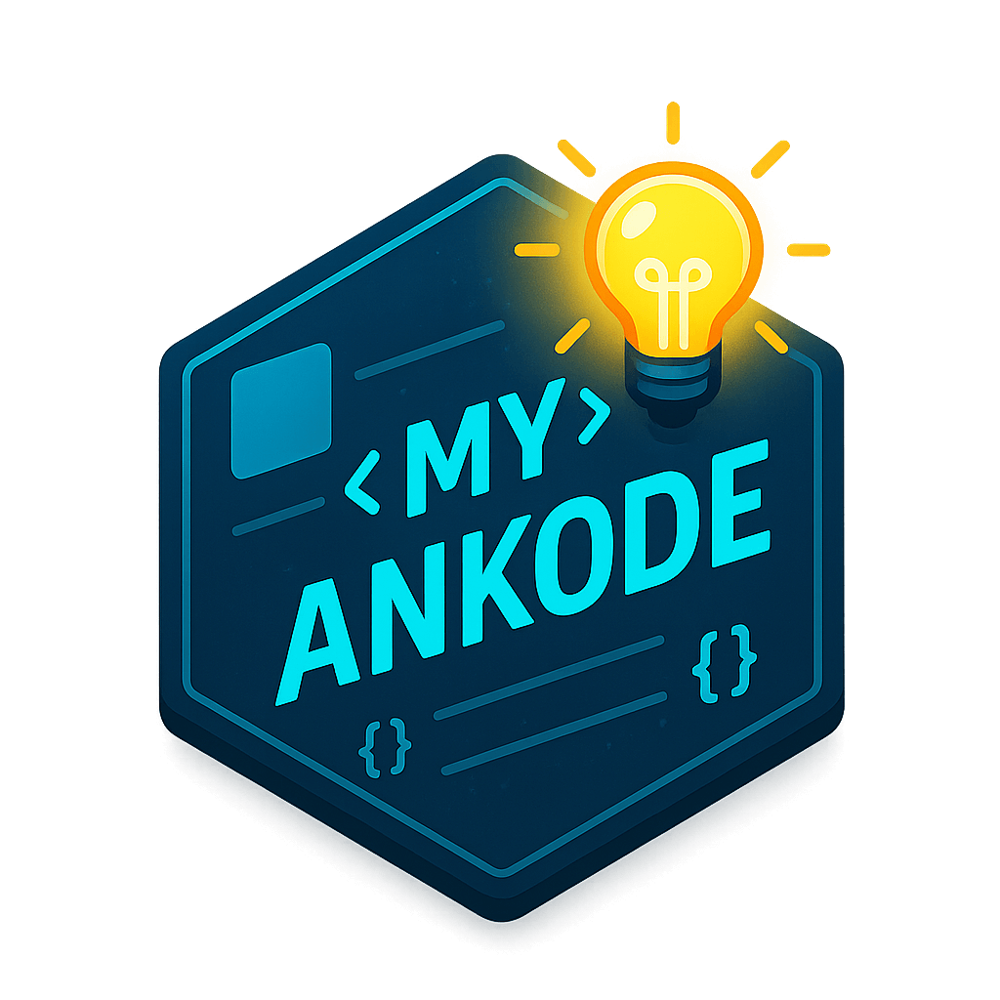
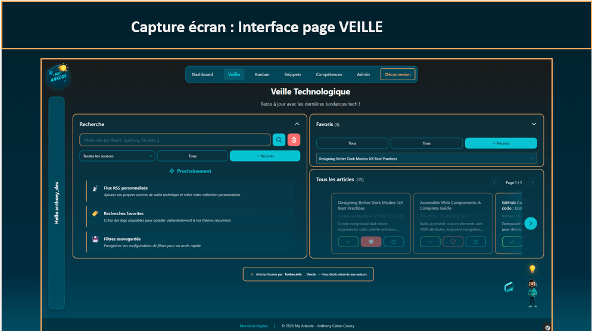
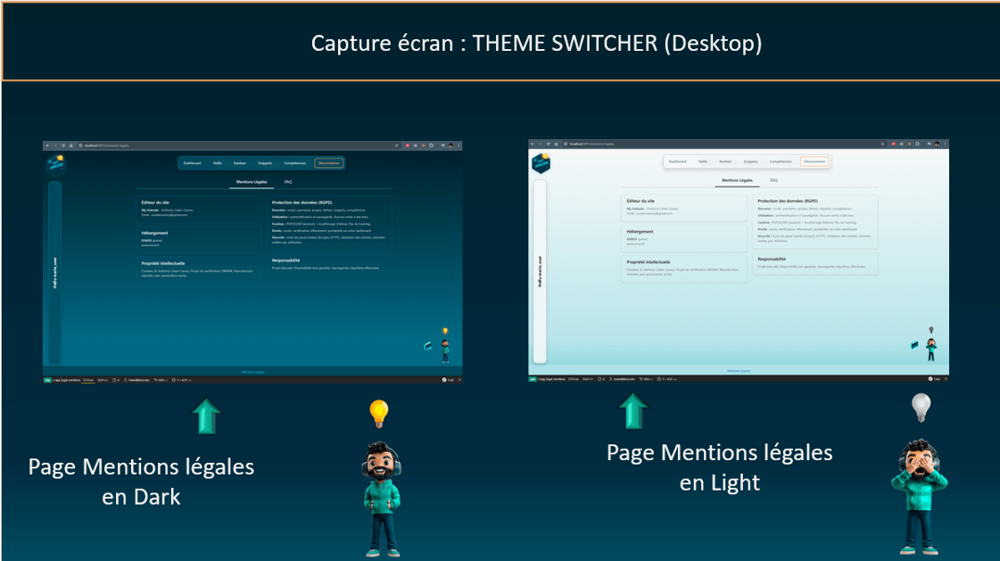

<div align="center">
  
  
  # MY-ANKODE
  
  **Plateforme de productivité pour développeurs juniors**
  
  Application web moderne combinant veille technologique, gestion de projets, bibliothèque de snippets et suivi de compétences.
  
  [](https://php.net)
  [](https://symfony.com)
  [](https://postgresql.org)
  [](https://mongodb.com)
  
</div>

---

## À propos

MY-ANKODE est une application web full-stack conçue pour accompagner les développeurs juniors dans leur montée en compétences. Elle centralise quatre modules essentiels au quotidien d'un développeur moderne.

### Fonctionnalités principales

- **Veille Technologique** : Agrégation RSS pour suivre l'actualité tech
- **Kanban** : Gestion de projets et tâches avec drag & drop
- **Snippets** : Bibliothèque de code réutilisable avec description poussée possible
- **Compétences** : Suivi personnalisé de progression technique

---

## Stack technique

### Backend
- **Framework** : Symfony 7.4 (PHP 8.3)
- **ORM** : Doctrine ORM (PostgreSQL) + Doctrine ODM (MongoDB)
- **Sécurité** : Symfony Security, CSRF Protection, Voters
- **Tests** : PHPUnit (135 tests unitaires et fonctionnels)

### Frontend
- **Templating** : Twig
- **Styling** : Bootstrap 5 + CSS Variables
- **JavaScript** : Vanilla JS (approche MVP)
- **Thème** : Dark/Light mode avec persistence

### Base de données
- **PostgreSQL** : Données relationnelles (Users, Projects, Tasks, Competences)
- **MongoDB** : Documents flexibles (Articles RSS, Snippets)

### Infrastructure
- **Conteneurisation** : Docker & Docker Compose
- **Services** : PHP-FPM, PostgreSQL, MongoDB
- **Administration** : pgAdmin, Mongo Express

---

## Installation rapide

### Prérequis

- Docker Desktop
- Git

### Démarrage

```bash
# Cloner le repository
git clone https://github.com/[votre-username]/my-ankode.git
cd my-ankode

# Copier et configurer l'environnement
cp backend/.env.example backend/.env

# Lancer les conteneurs
docker compose up -d

# Installer les dépendances
docker compose exec php composer install

# Créer la base de données et charger les fixtures
docker compose exec php php bin/console doctrine:database:create
docker compose exec php php bin/console doctrine:migrations:migrate -n
docker compose exec php php bin/console doctrine:mongodb:schema:create
docker compose exec php php bin/console doctrine:fixtures:load -n
```

### Accès à l'application

- **Application** : http://localhost:8080
- **pgAdmin** : http://localhost:5050
- **Mongo Express** : http://localhost:8081

**Compte de test** :
- Email : `anthony@myankode.com`
- Mot de passe : `password123`

---

## Documentation

La documentation technique est organisée en modules spécialisés :

- **[Architecture](docs/ARCHITECTURE.md)** : Architecture 3-tiers, schémas UML, structure BDD
- **[Sécurité](docs/SECURITY.md)** : Authentification, autorisation, OWASP Top 10
- **[Tests](docs/TESTING.md)** : Stratégie de tests, couverture, exemples
- **[Déploiement](docs/DEPLOYMENT.md)** : Guide Docker, environnements, troubleshooting
- **[Choix techniques](docs/TECHNICAL-CHOICES.md)** : PostgreSQL vs MongoDB, JS Vanilla, API REST
- **[Accessibilité](docs/ACCESSIBILITY.md)** : WCAG, navigation clavier, contraste
- **[Fonctionnalités](docs/FEATURES.md)** : Détails des 4 modules principaux

---

## Scripts utilitaires

```bash
# Réinitialiser toutes les fixtures (Docker)
./scripts/reset-all-fixtures-docker.sh

# Charger des articles de démonstration
./scripts/load-demo-articles-docker.sh

# Lancer les tests
docker compose exec php php bin/phpunit
```

---

## Captures d'écran

<div align="center">
  
  
</div>

---

## Développement

### Architecture

MY-ANKODE suit une architecture 3-tiers classique :

- **Présentation** : Templates Twig + Vanilla JS
- **Logique métier** : Controllers Symfony + Services
- **Données** : Repositories Doctrine (ORM + ODM)

### Conventions de code

- PSR-12 pour PHP
- Commits conventionnels (feat, fix, docs)
- Tests obligatoires pour les fonctionnalités critiques
- Code review avant merge

### Lancer les tests

```bash
# Tous les tests
docker compose exec php php bin/phpunit

# Tests spécifiques
docker compose exec php php bin/phpunit tests/Controller/
docker compose exec php php bin/phpunit tests/Security/
```

---

## Roadmap

### MVP (Livré)
- ✅ Authentification et autorisation
- ✅ CRUD complet sur les 4 modules
- ✅ Responsive design
- ✅ Dark/Light mode
- ✅ Tests de sécurité et fonctionnels

### Post-MVP (Prévu)
- Migration frontend vers Angular
- API REST complète pour consommation externe
- Authentification JWT

---


## Auteur

**Anthony Catan-Cavery**  
Développeur Web et Web Mobile fullstack
[GitHub](https://github.com/[votre-username]) • [LinkedIn](https://linkedin.com/in/[votre-profil])

---

<div align="center">
  <sub>Construit avec Symfony, PostgreSQL, MongoDB et passion pour le code propre</sub>
</div>