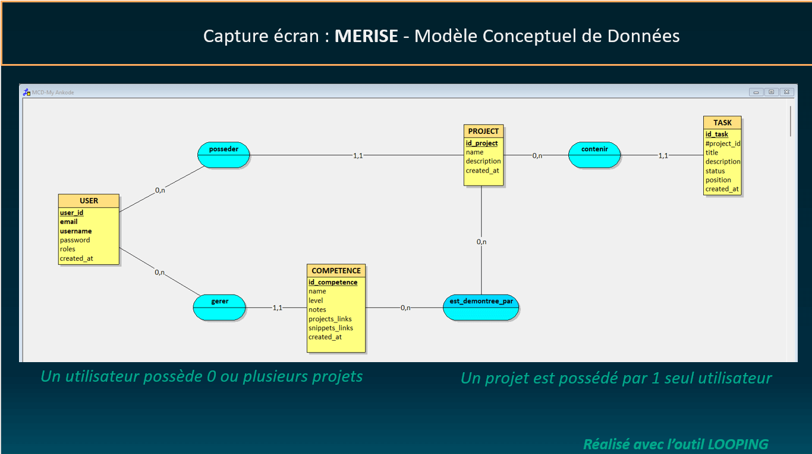
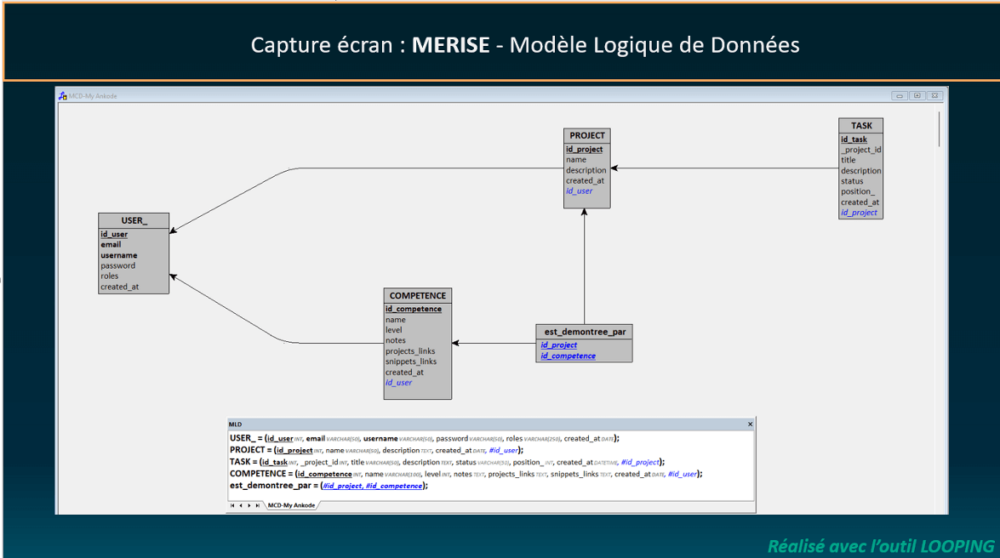
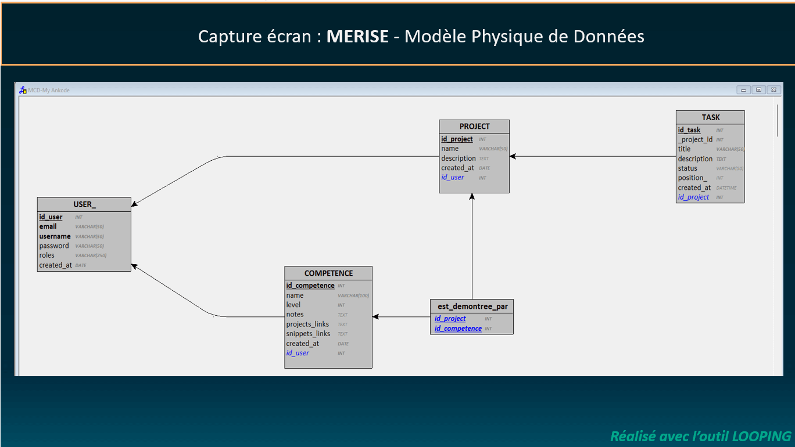
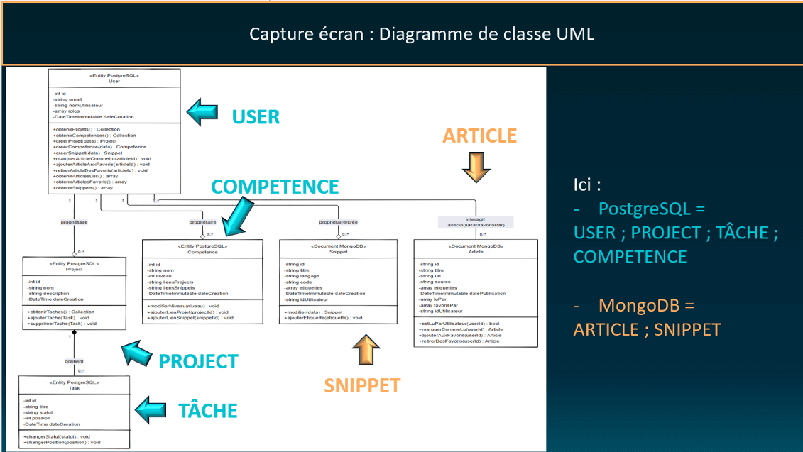

# Architecture

Documentation technique de l'architecture de MY-ANKODE.

[← Retour au README principal](../README.md)

---

## Table des matières

- [Vue d'ensemble](#vue-densemble)
- [Architecture 3-tiers](#architecture-3-tiers)
- [Stack technique](#stack-technique)
- [Structure des dossiers](#structure-des-dossiers)
- [Base de données](#base-de-données)
- [API REST](#api-rest)
- [Flux de données](#flux-de-données)

---

## Vue d'ensemble

MY-ANKODE est une application web full-stack construite sur une **architecture 3-tiers classique** séparant les responsabilités entre présentation, logique métier et accès aux données.

### Principes architecturaux

- **Séparation des responsabilités** : Chaque couche a un rôle bien défini
- **Injection de dépendances** : Service découplé et testables
- **Design patterns** : Repository, Voter pour la sécurité
- **SOLID** : Respect des principes de conception orientée objet

---

## Architecture 3-tiers

```
┌─────────────────────────────────────────────────────────────┐
│                    COUCHE PRÉSENTATION                      │
│  Templates Twig + Bootstrap 5 + Vanilla JavaScript          │
│  Responsive Design + Dark/Light Theme                       │
└─────────────────────────────────────────────────────────────┘
                            ▼
┌─────────────────────────────────────────────────────────────┐
│                    COUCHE LOGIQUE MÉTIER                    │
│         Controllers Symfony + Services + Voters             │
│       Validation (Assert) + Sécurité (CSRF, Voters)         │
└─────────────────────────────────────────────────────────────┘
                            ▼
┌─────────────────────────────────────────────────────────────┐
│                    COUCHE DONNÉES                           │
│   Repositories Doctrine ORM (PostgreSQL) + ODM (MongoDB)    │
│          Entities + Documents + Migrations                  │
└─────────────────────────────────────────────────────────────┘
```

### Tier 1 : Présentation

**Responsabilités** :
- Affichage des interfaces utilisateur (templates Twig)
- Interaction utilisateur (JavaScript vanilla)
- Validation côté client (UX uniquement)
- Thématisation (Dark/Light mode)

**Technologies** :
- Twig 3.x (templating engine)
- Bootstrap 5.3 (framework CSS)
- Vanilla JavaScript (ES6+)
- CSS Variables (personnalisation)

### Tier 2 : Logique Métier

**Responsabilités** :
- Traitement des requêtes HTTP (Controllers)
- Règles métier réutilisables (ex: RssFeedService pour agrégation RSS)
- Validation des données (Symfony Validator)
- Sécurité et autorisation (Voters)

**Technologies** :
- Symfony 7.4 (framework PHP)
- Dependency Injection Container
- Event Dispatcher
- Security Component

### Tier 3 : Accès aux Données

**Responsabilités** :
- Persistance des données
- Requêtes optimisées (DQL, Query Builder)
- Gestion des relations
- Migrations de schéma

**Technologies** :
- Doctrine ORM 3.x (PostgreSQL)
- Doctrine ODM 2.x (MongoDB)
- DQL (Doctrine Query Language)
- Migrations Doctrine

---

## Stack technique

### Backend

| Composant | Version | Rôle |
|-----------|---------|------|
| **PHP** | 8.3 | Langage serveur |
| **Symfony** | 7.4 | Framework MVC |
| **Doctrine ORM** | 3.x | Mapping objet-relationnel |
| **Doctrine ODM** | 2.x | Mapping objet-document |
| **PHPUnit** | 11.x | Tests unitaires |
| **Composer** | 2.x | Gestionnaire dépendances |

### Frontend

| Composant | Version | Rôle |
|-----------|---------|------|
| **Twig** | 3.x | Moteur de templates |
| **Bootstrap** | 5.3 | Framework CSS |
| **Vanilla JS** | ES6+ | Interactivité client |
| **CSS Variables** | - | Thématisation dynamique |

### Bases de données

| Système | Version | Usage |
|---------|---------|-------|
| **PostgreSQL** | 16 | Données relationnelles |
| **MongoDB** | 7.0 | Documents flexibles |

### Infrastructure

| Service | Version | Rôle |
|---------|---------|------|
| **Docker** | 24.x | Conteneurisation |
| **Docker Compose** | 2.x | Orchestration |
| **PHP-FPM** | 8.3 | Serveur d'application |
| **pgAdmin** | 4.x | Administration PostgreSQL |
| **Mongo Express** | 1.x | Administration MongoDB |

---

## Structure des dossiers

```
my-ankode/
├── backend/                        # Application Symfony
│   ├── bin/                        # Exécutables (console, phpunit)
│   ├── config/                     # Configuration Symfony
│   │   ├── packages/               # Config bundles
│   │   └── routes/                 # Définition routes
│   ├── migrations/                 # Migrations BDD PostgreSQL
│   ├── public/                     # Point d'entrée web
│   │   ├── css/                    # Styles personnalisés
│   │   └── js/                     # Scripts JavaScript
│   ├── src/                        # Code source
│   │   ├── Command/                # Commandes CLI
│   │   ├── Controller/             # Controllers HTTP
│   │   ├── DataFixtures/           # Données de test
│   │   ├── Document/               # Documents MongoDB (ODM)
│   │   ├── Entity/                 # Entités PostgreSQL (ORM)
│   │   ├── Form/                   # Formulaires Symfony
│   │   ├── Repository/             # Repositories (accès données)
│   │   ├── Security/               # Voters, Authenticators
│   │   └── Service/                # Services métier
│   ├── templates/                  # Templates Twig
│   ├── tests/                      # Tests PHPUnit
│   └── var/                        # Cache, logs (non versionné)
│
├── frontend/                       # Préparation Angular (post-MVP)
│
├── docs/                           # Documentation technique
│   ├── assets/                     # Images, diagrammes
│   ├── ARCHITECTURE.md             # Ce document
│   ├── SECURITY.md                 # Documentation sécurité
│   ├── TESTING.md                  # Stratégie tests
│   └── ...                         # Autres docs
│
├── scripts/                        # Scripts utilitaires
│   ├── reset-all-fixtures-docker.sh
│   └── load-demo-articles-docker.sh
│
├── docker-compose.yml              # Orchestration conteneurs
└── README.md                       # Documentation principale
```

---

## Base de données

### Architecture hybride

MY-ANKODE utilise une approche **polyglot persistence** combinant PostgreSQL et MongoDB selon la nature des données.

#### PostgreSQL - Données relationnelles

**Usage** : Données structurées avec relations fortes

**Entités** :
- `User` : Utilisateurs de l'application
- `Project` : Projets Kanban
- `Task` : Tâches liées aux projets
- `Competence` : Compétences techniques suivies

**Schémas** :

<div align="center">
  
  <p><em>Modèle Conceptuel de Données (MCD)</em></p>
</div>

<div align="center">
  
  <p><em>Modèle Logique de Données (MLD)</em></p>
</div>

<div align="center">
  
  <p><em>Modèle Physique de Données (MPD)</em></p>
</div>

**Relations principales** :
- User `1-N` Project (un utilisateur possède plusieurs projets)
- Project `1-N` Task (un projet contient plusieurs tâches)
- User `1-N` Competence (un utilisateur suit plusieurs compétences)

#### MongoDB - Documents flexibles

**Usage** : Données semi-structurées sans schéma fixe

**Collections** :
- `Article` : Articles RSS de veille technologique
- `Snippet` : Morceaux de code réutilisables

**Avantages** :
- Schéma flexible (champs dynamiques)
- Performance en lecture
- Scalabilité horizontale
- Stockage de tableaux et objets imbriqués

### Exemples de code

#### Entité PostgreSQL (ORM)

```php
#[ORM\Entity(repositoryClass: ProjectRepository::class)]
class Project
{
    #[ORM\Id]
    #[ORM\GeneratedValue]
    #[ORM\Column]
    private ?int $id = null;

    #[ORM\Column(length: 255)]
    #[Assert\NotBlank]
    #[Assert\Length(min: 3, max: 255)]
    private ?string $name = null;

    #[ORM\ManyToOne(inversedBy: 'projects')]
    #[ORM\JoinColumn(nullable: false)]
    private ?User $owner = null;

    #[ORM\OneToMany(mappedBy: 'project', targetEntity: Task::class, cascade: ['remove'])]
    private Collection $tasks;
}
```

#### Document MongoDB (ODM)

```php
#[ODM\Document(collection: 'snippets')]
class Snippet
{
    #[ODM\Id]
    private ?string $id = null;

    #[ODM\Field(type: 'string')]
    private ?string $userId = null;

    #[ODM\Field(type: 'string')]
    private ?string $title = null;

    #[ODM\Field(type: 'string')]
    private ?string $code = null;

    #[ODM\Field(type: 'collection')]
    private array $tags = [];
}
```

<div align="center">
  
  <p><em>Diagramme de classes UML</em></p>
</div>

---

## API REST

MY-ANKODE expose des API REST pour chaque module, préparant la migration frontend vers Angular.

### Principes REST

- **Verbes HTTP** : GET, POST, PUT, DELETE
- **Codes de statut** : 200 (OK), 201 (Created), 400 (Bad Request), 404 (Not Found)
- **Format JSON** : Requêtes et réponses
- **Stateless** : Aucune session côté serveur (prêt pour JWT)

### Endpoints principaux

#### Projets

| Méthode | Endpoint | Description |
|---------|----------|-------------|
| `GET` | `/api/projects` | Liste tous les projets de l'utilisateur |
| `GET` | `/api/projects/{id}` | Détails d'un projet |
| `POST` | `/api/projects` | Créer un nouveau projet |
| `PUT` | `/api/projects/{id}` | Modifier un projet |
| `DELETE` | `/api/projects/{id}` | Supprimer un projet |

#### Tâches

| Méthode | Endpoint | Description |
|---------|----------|-------------|
| `GET` | `/api/tasks` | Liste toutes les tâches |
| `POST` | `/api/tasks` | Créer une tâche |
| `PUT` | `/api/tasks/{id}` | Modifier une tâche |
| `DELETE` | `/api/tasks/{id}` | Supprimer une tâche |
| `PATCH` | `/api/tasks/{id}/status` | Changer le statut (drag & drop) |

#### Articles (Veille)

| Méthode | Endpoint | Description |
|---------|----------|-------------|
| `GET` | `/api/articles` | Liste des articles RSS |
| `GET` | `/api/articles/sources` | Sources RSS disponibles |
| `GET` | `/api/articles/search?q={keyword}` | Recherche dans les articles |
| `PATCH` | `/api/articles/{id}/mark-read` | Marquer comme lu/non lu |
| `POST` | `/api/articles/{id}/favorite` | Ajouter aux favoris |
| `DELETE` | `/api/articles/{id}/favorite` | Retirer des favoris |
| `GET` | `/api/articles/favorites` | Liste des articles favoris |

#### Snippets

| Méthode | Endpoint | Description |
|---------|----------|-------------|
| `GET` | `/api/snippets` | Liste des snippets |
| `POST` | `/api/snippets` | Créer un snippet |
| `PUT` | `/api/snippets/{id}` | Modifier un snippet |
| `DELETE` | `/api/snippets/{id}` | Supprimer un snippet |

#### Compétences

| Méthode | Endpoint | Description |
|---------|----------|-------------|
| `GET` | `/api/competences` | Liste des compétences |
| `POST` | `/api/competences` | Créer une compétence |
| `PUT` | `/api/competences/{id}` | Modifier une compétence |
| `DELETE` | `/api/competences/{id}` | Supprimer une compétence |

### Exemple de réponse

```json
{
  "id": 1,
  "name": "MY-ANKODE v2.0",
  "description": "Refonte complète avec Angular",
  "createdAt": "2025-01-15 10:30:00",
  "tasks": [
    {
      "id": 5,
      "title": "Migrer le module Kanban",
      "status": "in_progress"
    }
  ]
}
```

---

## Flux de données

### Exemple : Création d'un projet

```
┌─────────────┐
│   Client    │
│  (Browser)  │
└──────┬──────┘
       │ 1. POST /api/projects
       │    {name: "Mon projet", description: "..."}
       ▼
┌─────────────────────────┐
│   ProjectController     │
│  - Valide CSRF token    │
│  - Valide données       │
│  - Vérifie ownership    │
└──────┬──────────────────┘
       │ 2. Appel Repository
       ▼
┌─────────────────────────┐
│   ProjectRepository     │
│  - Persist l'entité     │
│  - Flush vers BDD       │
└──────┬──────────────────┘
       │ 3. INSERT SQL
       ▼
┌─────────────────────────┐
│      PostgreSQL         │
│  - Stocke le projet     │
│  - Retourne l'ID        │
└──────┬──────────────────┘
       │ 4. Réponse JSON
       ▼
┌─────────────┐
│   Client    │
│  Affiche    │
│  le projet  │
└─────────────┘
```

### Sécurité du flux

1. **CSRF Token** : Validé automatiquement par `CsrfValidationSubscriber`
2. **Authentification** : `#[IsGranted('ROLE_USER')]` sur le controller
3. **Autorisation** : `ResourceVoter` vérifie l'ownership avant modification
4. **Validation** : Contraintes Symfony Assert sur les entités
5. **Sanitization** : `htmlspecialchars()` sur les sorties

---

## Évolution future

### Migration Angular (Post-MVP)

L'architecture actuelle prépare la migration vers Angular :

- API REST complète et documentée
- Séparation front/back déjà en place
- JWT ready (authentification stateless)
- Architecture API-first facilitant la consommation externe

### Évolutions possibles

- **Migration frontend Angular** : Frontend moderne avec TypeScript
- **Authentification JWT** : API stateless pour applications mobiles
- **Temps réel** : Notifications live sur changements Kanban
- **Optimisations** : Cache et performance si montée en charge

---

[← Retour au README principal](../README.md)
