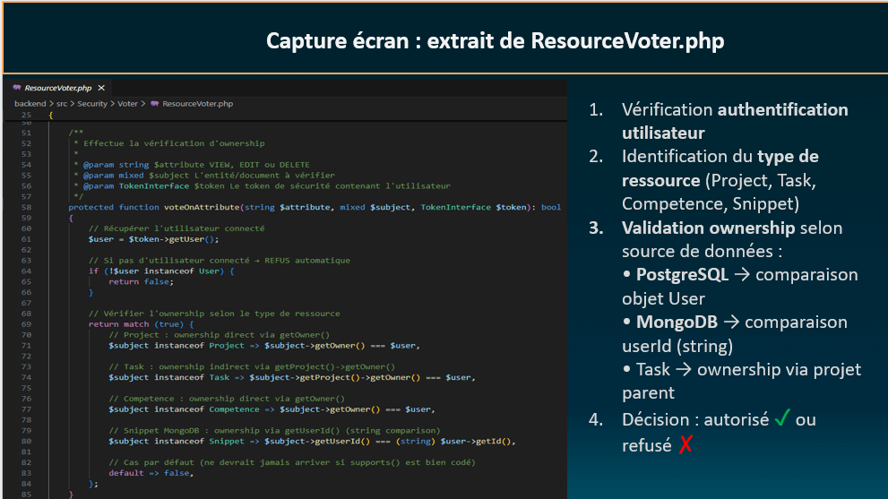
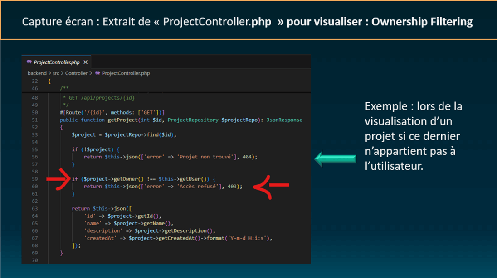
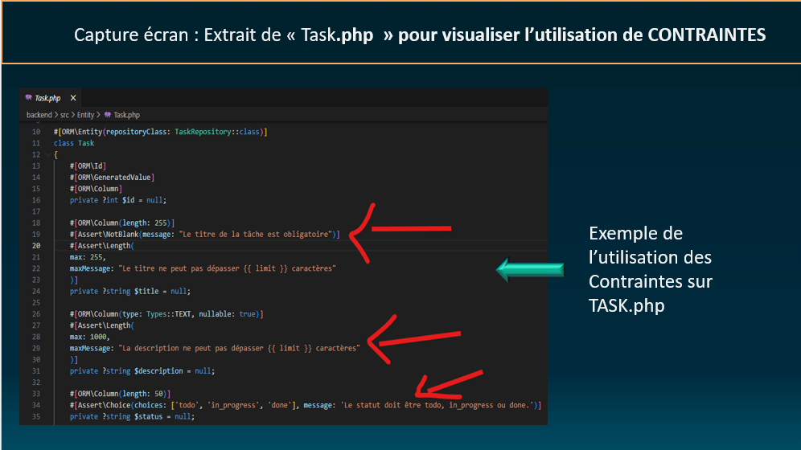
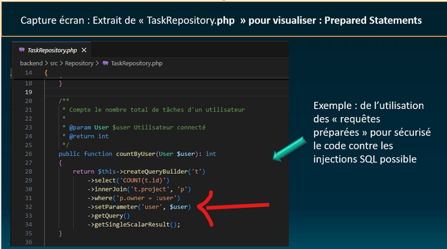

# Sécurité

Documentation des mécanismes de sécurité implémentés dans MY-ANKODE.

[← Retour au README principal](../README.md)

---

## Table des matières

- [Vue d'ensemble](#vue-densemble)
- [Authentification](#authentification)
- [Autorisation](#autorisation)
- [Protection CSRF](#protection-csrf)
- [Validation et sanitization](#validation-et-sanitization)
- [Sécurité des mots de passe](#sécurité-des-mots-de-passe)
- [OWASP Top 10](#owasp-top-10)
- [Tests de sécurité](#tests-de-sécurité)

---

## Vue d'ensemble

MY-ANKODE implémente une approche **defense-in-depth** (défense en profondeur) avec plusieurs couches de sécurité :

### Principes appliqués

1. **Authentification forte** : Sessions sécurisées Symfony
2. **Autorisation granulaire** : Voters pour vérifier l'ownership
3. **Protection CSRF** : Tokens sur toutes les modifications
4. **Validation rigoureuse** : Contraintes Assert + sanitization
5. **Hashage sécurisé** : Argon2id pour les mots de passe
6. **Least Privilege** : Accès minimal par défaut

### Architecture de sécurité

```
┌─────────────────────────────────────────────────────────┐
│                    REQUÊTE UTILISATEUR                  │
└──────────────────────┬──────────────────────────────────┘
                       │
                       ▼
┌─────────────────────────────────────────────────────────┐
│  COUCHE 1 : Authentification                            │
│  ✓ Session Symfony valide ?                             │
│  ✓ Utilisateur connecté ?                               │
└──────────────────────┬──────────────────────────────────┘
                       │
                       ▼
┌─────────────────────────────────────────────────────────┐
│  COUCHE 2 : Protection CSRF                             │
│  ✓ Token CSRF valide ? (POST/PUT/PATCH/DELETE)          │
│  ✓ CsrfValidationSubscriber                             │
└──────────────────────┬──────────────────────────────────┘
                       │
                       ▼
┌─────────────────────────────────────────────────────────┐
│  COUCHE 3 : Autorisation (Voters)                       │
│  ✓ L'utilisateur est-il propriétaire de la ressource ?  │
│  ✓ ResourceVoter pour Project/Task/Competence/Snippet   │
└──────────────────────┬──────────────────────────────────┘
                       │
                       ▼
┌─────────────────────────────────────────────────────────┐
│  COUCHE 4 : Validation                                  │
│  ✓ Données conformes (Symfony Assert) ?                 │
│  ✓ Sanitization (htmlspecialchars)                      │
└──────────────────────┬──────────────────────────────────┘
                       │
                       ▼
┌─────────────────────────────────────────────────────────┐
│               TRAITEMENT SÉCURISÉ                       │
└─────────────────────────────────────────────────────────┘
```

---

## Authentification

### Mécanisme

MY-ANKODE utilise le composant **Symfony Security** avec authentification par session.

#### Configuration

```yaml
# config/packages/security.yaml
security:
    password_hashers:
        Symfony\Component\Security\Core\User\PasswordAuthenticatedUserInterface: 'auto'
    
    providers:
        app_user_provider:
            entity:
                class: App\Entity\User
                property: email
    
    firewalls:
        main:
            lazy: true
            provider: app_user_provider
            form_login:
                login_path: app_login
                check_path: app_login
            logout:
                path: app_logout
```

### Flux d'authentification

1. **Login** : Utilisateur saisit email + password
2. **Vérification** : Symfony compare le hash stocké avec le password fourni
3. **Session** : Création d'une session sécurisée
4. **Token** : Token d'authentification stocké en session

### Protection des routes

```php
#[Route('/api/projects')]
#[IsGranted('ROLE_USER')]  // Authentification obligatoire
class ProjectController extends AbstractController
{
    // ...
}
```

### Déconnexion

```php
#[Route('/logout', name: 'app_logout')]
public function logout(): void
{
    // Symfony gère automatiquement la déconnexion
}
```

---

## Autorisation

### ResourceVoter - Vérification d'ownership

MY-ANKODE implémente un **Voter centralisé** qui vérifie que l'utilisateur connecté est bien le propriétaire de la ressource qu'il tente de manipuler.

#### Principe

```php
// Avant toute modification/consultation
#[IsGranted('EDIT', subject: 'project')]
public function updateProject(Project $project): Response
{
    // ResourceVoter vérifie automatiquement :
    // - $project->getOwner() === $this->getUser()
    
    // Si FAUX → 403 Forbidden
    // Si VRAI → Action autorisée
}
```

#### Implémentation

<div align="center">
  
  <p><em>Code du ResourceVoter</em></p>
</div>

**Ressources protégées** :
- `Project` : ownership via `getOwner()`
- `Task` : ownership indirect via `getProject()->getOwner()`
- `Competence` : ownership via `getOwner()`
- `Snippet` (MongoDB) : ownership via `getUserId()`

**Permissions** :
- `VIEW` : Lecture de la ressource
- `EDIT` : Modification
- `DELETE` : Suppression

#### Exemple d'usage

```php
// GET /api/projects/5
#[Route('/{id}', methods: ['GET'])]
#[IsGranted('VIEW', subject: 'project')]
public function getProject(Project $project): JsonResponse
{
    // Voter vérifie automatiquement l'ownership
    // Si Alice tente d'accéder au projet de Bob → 403
}
```

<div align="center">
  
  <p><em>Tests d'ownership et filtrage</em></p>
</div>

---

## Protection CSRF

### Qu'est-ce que CSRF ?

**Cross-Site Request Forgery** : Attaque forçant un utilisateur authentifié à exécuter des actions non désirées.

**Exemple d'attaque** :
```html
<!-- Site malveillant evil.com -->
<form action="https://myankode.com/api/projects/5" method="POST">
    <input type="hidden" name="name" value="Projet hacké">
</form>
<script>document.forms[0].submit();</script>
```

Sans protection CSRF, si l'utilisateur est connecté à MY-ANKODE, la requête s'exécute.

### Protection implémentée

MY-ANKODE utilise un **Event Subscriber** qui valide automatiquement le token CSRF sur toutes les routes API modifiant des données.

#### CsrfValidationSubscriber

```php
class CsrfValidationSubscriber implements EventSubscriberInterface
{
    private const METHODS_REQUIRING_CSRF = ['POST', 'PUT', 'PATCH', 'DELETE'];

    public function onKernelRequest(RequestEvent $event): void
    {
        $request = $event->getRequest();
        
        // Vérifier le header X-CSRF-Token
        $token = $request->headers->get('X-CSRF-Token');
        
        if (!$token || !$this->csrfTokenManager->isTokenValid(new CsrfToken('api', $token))) {
            throw new BadRequestHttpException('Token CSRF invalide');
        }
    }
}
```

#### Utilisation côté client

```javascript
// 1. Récupérer le token CSRF
const csrfToken = document.querySelector('meta[name="csrf-token"]').content;

// 2. L'envoyer dans chaque requête
fetch('/api/projects', {
    method: 'POST',
    headers: {
        'Content-Type': 'application/json',
        'X-CSRF-Token': csrfToken  // Token obligatoire
    },
    body: JSON.stringify({name: 'Mon projet'})
});
```

**Avantages** :
- Protection automatique sur toutes les routes API
- Pas besoin de gérer manuellement les tokens dans chaque controller
- Validation centralisée

---

## Validation et sanitization

### Validation côté serveur

MY-ANKODE utilise **Symfony Validator** avec des contraintes Assert sur les entités.

#### Exemple : Entité Project

```php
class Project
{
    #[Assert\NotBlank(message: "Le nom du projet est obligatoire")]
    #[Assert\Length(
        max: 255,
        maxMessage: "Le nom ne peut pas dépasser {{ limit }} caractères"
    )]
    private ?string $name = null;

    #[Assert\Length(
        max: 1000,
        maxMessage: "La description ne peut pas dépasser {{ limit }} caractères"
    )]
    private ?string $description = null;
}
```

#### Validation dans les controllers

```php
public function createProject(
    Request $request,
    ValidatorInterface $validator
): JsonResponse {
    $project = new Project();
    $project->setName($data['name']);
    
    // Validation automatique
    $errors = $validator->validate($project);
    
    if (count($errors) > 0) {
        return $this->json(['errors' => (string) $errors], 400);
    }
}
```

<div align="center">
  
  <p><em>Contraintes de validation Assert</em></p>
</div>

### Sanitization des entrées

#### Protection XSS

MY-ANKODE utilise une approche **API-first** avec JavaScript vanilla.

**Côté backend** :
```php
// Les données sont stockées brutes (pas de sanitization prématurée)
$project->setDescription($data['description']);
```

**Côté frontend** :
```javascript
// Affichage via JavaScript : échappement manuel recommandé
const div = document.createElement('div');
div.textContent = project.description;  // ✅ Échappe automatiquement

// OU création sécurisée de HTML
div.innerHTML = `${escapeHtml(project.description)}`;

function escapeHtml(text) {
    const div = document.createElement('div');
    div.textContent = text;
    return div.innerHTML;
}
```

**Templates Twig** (utilisés pour la structure, pas les données) :
```twig
{# Twig échappe automatiquement les variables #}
{{ user.email }}  {# Échappé par défaut #}
```

**Note** : MY-ANKODE charge les données dynamiquement via JavaScript (approche SPA), donc la protection XSS repose principalement sur l'utilisation correcte de `textContent` plutôt que `innerHTML` direct.

---

#### Protection injection SQL

Doctrine ORM utilise des **prepared statements** automatiquement :

```php
// SÉCURISÉ (Doctrine échappe automatiquement)
$qb->where('p.owner = :user')
   ->setParameter('user', $user);

// DANGEREUX (jamais faire ça)
$query = "SELECT * FROM project WHERE name = '" . $_POST['name'] . "'";
```

<div align="center">
  
  <p><em>Protection injection SQL avec Prepared Statements</em></p>
</div>

---

## Sécurité des mots de passe

### Hashage automatique

MY-ANKODE utilise **Argon2id** (ou bcrypt selon config PHP) pour hasher les mots de passe.

#### Configuration

```yaml
# config/packages/security.yaml
security:
    password_hashers:
        Symfony\Component\Security\Core\User\PasswordAuthenticatedUserInterface: 'auto'
```

**`auto`** = Symfony choisit le meilleur algorithme disponible :
- Argon2id (si disponible) - **RECOMMANDÉ**
- Argon2i
- Bcrypt (fallback)

#### Hashage lors de l'inscription

```php
class RegistrationController extends AbstractController
{
    public function register(
        UserPasswordHasherInterface $passwordHasher
    ): Response {
        $user = new User();
        
        // Hash automatique du mot de passe
        $hashedPassword = $passwordHasher->hashPassword(
            $user,
            $form->get('plainPassword')->getData()
        );
        
        $user->setPassword($hashedPassword);
        // Stocké : $2y$13$AbC...XyZ (bcrypt) ou $argon2id$...
    }
}
```

### Bonnes pratiques

- ✅ Mot de passe **jamais stocké en clair**
- ✅ Hash avec **salt aléatoire** (géré automatiquement)
- ✅ Algorithme **moderne et résistant** (Argon2id)
- ✅ Mot de passe **jamais exposé** dans les réponses API

### Vérification

```php
// Lors du login
$passwordHasher->isPasswordValid($user, $plainPassword)
// → Compare le hash stocké avec le password fourni
```

---

## OWASP Top 10

MY-ANKODE couvre les principales vulnérabilités du **OWASP Top 10 2021** :

### 1. Broken Access Control

**Protection** : ResourceVoter vérifie l'ownership sur chaque ressource

```php
#[IsGranted('EDIT', subject: 'project')]
public function updateProject(Project $project) {
    // Voter refuse si l'user n'est pas owner
}
```

### 2. Cryptographic Failures

**Protection** : 
- Argon2id pour les passwords
- Sessions HTTPS en production
- Pas de données sensibles en clair

### 3. Injection

**Protection** :
- **SQL** : Doctrine Prepared Statements
- **NoSQL** : MongoDB ODM échappe les requêtes
- **XSS** : Twig échappe automatiquement

### 4. Insecure Design

**Protection** :
- Architecture 3-tiers séparée
- Principe de moindre privilège
- Defense-in-depth

### 5. Security Misconfiguration

**Protection** :
- `.env` non versionné
- Erreurs détaillées uniquement en dev
- Headers de sécurité (si nelmio/security-bundle)

### 6. Vulnerable Components

**Protection** :
- Dépendances à jour (`composer update`)
- Scan sécurité : `symfony security:check`

### 7. Identification and Authentication Failures

**Protection** :
- Sessions Symfony sécurisées
- Passwords hashés (Argon2id)
- Logout fonctionnel

### 8. Software and Data Integrity Failures

**Protection** :
- Validation stricte des entrées
- Contraintes Assert sur entités
- CSRF protection

### 9. Security Logging Failures

**Protection** :
- Logs Symfony en `var/log/`
- Environnements séparés (dev/prod/test)

### 10. Server-Side Request Forgery (SSRF)

**Protection** :
- Pas de requêtes externes basées sur input user
- Validation des URLs si nécessaire

---

## Tests de sécurité

MY-ANKODE inclut **135 tests** dont plusieurs dédiés à la sécurité.

### Tests d'authentification

```php
// Test : Accès sans login → 400 (CSRF manquant)
public function testCreateProjectWithoutLogin(): void
{
    $this->jsonRequest('POST', '/api/projects', [...]);
    $this->assertResponseStatusCodeSame(400);
}
```

### Tests d'ownership

```php
// Test : Alice ne peut pas modifier le projet de Bob
public function testUserCannotEditOthersProject(): void
{
    $this->loginUser($alice);
    $this->apiRequest('PUT', "/api/projects/{$bobProjectId}", [...]);
    $this->assertResponseStatusCodeSame(403); // Forbidden
}
```

### Tests CSRF

```php
// Test : Requête POST sans token CSRF → 400
public function testCsrfProtectionOnPost(): void
{
    $this->client->request('POST', '/api/projects', [...]);
    $this->assertResponseStatusCodeSame(400);
}
```

### Tests injection SQL

```php
// Test : Tentative injection SQL bloquée
public function testSqlInjectionIsBlocked(): void
{
    $maliciousName = "Mon Projet'; DROP TABLE project; --";
    $this->apiRequest('POST', '/api/projects', ['name' => $maliciousName]);
    
    // Le projet est créé avec le nom malveillant ÉCHAPPÉ
    $this->assertResponseStatusCodeSame(201);
    
    // La table project existe toujours
    $projects = $this->entityManager->getRepository(Project::class)->findAll();
    $this->assertNotEmpty($projects);
}
```

### Tests XSS

```php
// Test : Script XSS stocké sans exécution
public function testXssScriptIsStoredSafely(): void
{
    $xssPayload = '<script>alert("XSS")</script>';
    $this->apiRequest('POST', '/api/projects', ['description' => $xssPayload]);
    
    // Le script est stocké tel quel (échappé à l'affichage par Twig)
    $this->assertResponseStatusCodeSame(201);
}
```

### Tests hashage password

```php
// Test : Password hashé, jamais en clair
public function testPasswordIsHashedNotPlaintext(): void
{
    $user = $this->createUser('test@example.com', 'MyPassword123!');
    
    // Le password stocké n'est PAS le plaintext
    $this->assertNotEquals('MyPassword123!', $user->getPassword());
    
    // C'est un hash bcrypt/argon2
    $this->assertTrue(password_verify('MyPassword123!', $user->getPassword()));
}
```

---

## Checklist sécurité

### Avant déploiement

- [ ] Toutes les routes API ont `#[IsGranted('ROLE_USER')]`
- [ ] ResourceVoter appliqué sur toutes les modifications
- [ ] CSRF activé sur POST/PUT/PATCH/DELETE
- [ ] Validation Assert sur toutes les entités
- [ ] `.env` dans `.gitignore`
- [ ] Headers sécurité (Content-Security-Policy, X-Frame-Options)
- [ ] Tests de sécurité passent (135/135)
- [ ] Logs activés en production

---

[← Retour au README principal](../README.md)
